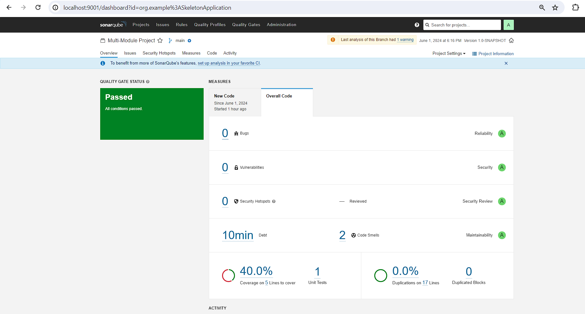
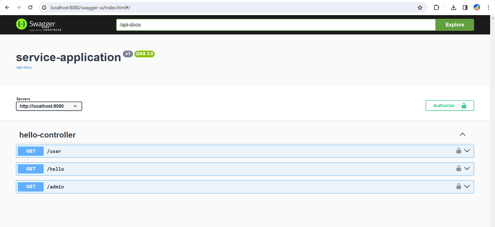

# SkeletonApplication

This is a skeleton Java Spring boot multi-module application.

## Technologies Used:
1. JDK17
2. Spring boot 3.2
3. Cucumber 7
4. SonarQube
5. Postgres DB
6. Docker

## Roles of different modules: 

1. `aggregate-report` takes care of generating the code coverage report by gathering results from other modules.
2. `integration-tests` holds all the integration tests written in cucumber framework.
3. `service` module holds all the rest controllers and service/business logic.

## Prerequisites: 
1. JDK 17
2. Maven 3
3. Docker

## Steps to run the Project
1. Clone the project using git clone
2. Run mvn clean install

## Note:
````
Before running mvn clean install make sure the docker is up.
mvn clean install will spin up the required docker containers and publish the test-report to sonarqube.
To keep your environment running set the property spring.docker.compose.lifecycle-management to start-only. 
The default property start-and-stop stops the environment after finishing.
All the sonar related configurations are in sonar-project.properties file.
````

To access generated sonar report go to http://localhost:9000

Login into sonarqube using admin/admin default credentials



Click to access [Swagger](http://localhost:8080/swagger-ui/index.html#/)


# Setup keycloack for your application:

Click to access [keycloack](http://localhost:8890/admin/master/console/).
Steps:
1. Login using admin/admin default credentials
2. create a new realm with `MySuperApplicationRealm` name.
3. Create a client with name `my-super-client`.
4. In the Valid redirect URIs enter `http://localhost:8080/*`.
5. Copy the client secret and save it somewhere. This secret will be used to authenticate our service app with keykloack.
6. Create 2 users one with admin role and other with user role.
7. Now run the application.
8. Generate the token following [this](http://localhost:8890/realms/MySuperApplicationRealm) url and passing client token and client secret.
9. Now you can access the admin and user by passing the client id, client secret and users username and password.


